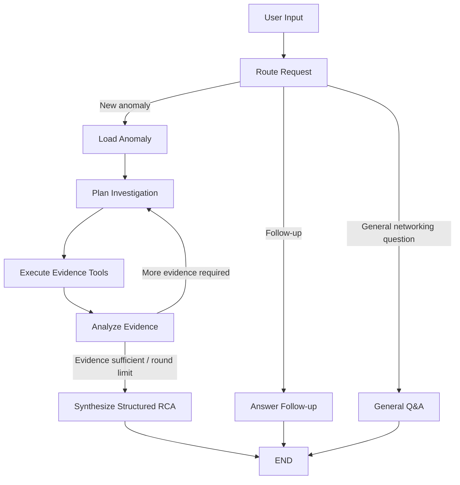

# Network Investigation Agent for Root Cause Analysis

A stateful **LangGraph-based Network Investigation Agent** that investigates detected network anomalies using evidence from a provided PostgreSQL database and produces structured, evidence-grounded root cause analyses.

The agent starts **after anomaly detection**. Given an `anomaly_id`, it decides which evidence is useful, retrieves that evidence through controlled read-only tools, assesses whether the available evidence is sufficient, and either gathers additional evidence or produces a structured RCA.

It also supports conversational follow-up questions using retained investigation context and general networking questions without unnecessarily querying the database.

---

## What Was Provided vs. What I Built

### Provided by the Challenge

The challenge supplied:

- PostgreSQL 16 with seeded network data
- Four evidence tables:
  - `detected_anomalies`
  - `network_devices`
  - `device_syslogs`
  - `device_telemetry`
- Docker/Compose environment
- JupyterLab
- Adminer
- Database connection helper (`db.py`)
- Starter `graph.py` and `main.py`
- Schema documentation and seed data

The database, container infrastructure, and anomaly-detection data were **not built as part of this submission**.

### My Implementation

I implemented the investigation layer on top of the supplied environment:

- LangGraph investigation workflow
- Generic read-only evidence tools
- Explicit structured investigation state
- Intent routing
- LLM-driven investigation planning
- Deterministic tool execution and parameter validation
- Evidence sufficiency analysis
- Bounded multi-round investigation
- Structured RCA synthesis
- Conversational follow-up memory
- General networking Q&A path
- Evaluation runner across all 10 seeded anomalies
- Completed CLI interface
- Lightweight optional Streamlit demonstration layer

---

## Architecture

The workflow is designed as a controlled **reason → act → observe → assess** loop rather than an unconstrained LLM loop.



### Why LangGraph?

LangGraph provides explicit control over:

- shared investigation state
- nodes with single responsibilities
- conditional routing
- bounded investigation loops
- conversational checkpointing
- separation of reasoning from deterministic execution

The LLM performs semantic reasoning inside selected nodes, while LangGraph determines the allowed execution paths.

The investigation loop is intentionally bounded to prevent uncontrolled execution. The current implementation allows a maximum of three investigation rounds.

### Single-Agent vs. Multi-Agent Design

This implementation is intentionally a **single stateful investigation agent**, not a collection of independent agents.

Responsibilities are separated into specialized LangGraph nodes:

- request routing
- anomaly loading
- investigation planning
- tool execution
- evidence assessment
- RCA synthesis
- conversational follow-up
- general networking Q&A

These components share the same `AgentState` and participate in one controlled investigation workflow.

I chose this design because the stages are tightly coupled around a single investigation state. Separate autonomous agents would add coordination complexity without providing a clear benefit for the scope of this assignment.

---

## Evidence Tools

The agent exposes generic evidence-source tools rather than anomaly-specific investigation functions.

| Tool | Evidence Source | Purpose |
|---|---|---|
| `get_anomaly` | `detected_anomalies` | Retrieve anomaly metadata, detector output, impacted hosts and time window |
| `get_device_context` | `network_devices` | Resolve devices and obtain inventory/topology context |
| `get_syslogs` | `device_syslogs` | Retrieve time-bounded device events and protocol/system messages |
| `get_telemetry` | `device_telemetry` | Retrieve time-series network/device metrics |

I intentionally did **not** implement functions such as:

```text
investigate_interface_flap()
investigate_bgp()
investigate_policy_deny()
```

Instead, the planning node reasons over the anomaly and evidence already collected and decides which evidence source is useful next.

The LLM does not execute arbitrary SQL. Application code validates the requested tool and parameters and executes only the allowed read-only evidence tools.

---

## Investigation State

Conversation history and structured investigation context are stored separately.

The LangGraph `AgentState` contains information such as:

```text
Conversation
  messages

Request routing
  intent

Investigation
  anomaly_id
  anomaly

Retrieved evidence
  device_context
  syslogs
  telemetry

Planning / control
  planned_actions
  investigation_summary
  evidence_assessment
  needs_more_evidence
  investigation_round

Result
  rca
```

This prevents critical investigation context from having to be reconstructed from conversational prose on every turn.

---

## Conversational Memory

Conversational continuity is implemented using three components:

1. **Structured `AgentState`** stores conversation history and investigation context.
2. **LangGraph `MemorySaver`** is used as the graph checkpointer.
3. The CLI creates one **`thread_id`** and reuses it for all turns in that session.

Therefore, after an investigation completes, a user can ask:

```text
Why do you believe this was a physical-layer problem?
```

without supplying the anomaly ID again.

The request router recognizes the request as `follow_up` and routes it to the follow-up path using the retained investigation context rather than starting the anomaly investigation from scratch.

`MemorySaver` is an in-memory checkpointer. Persistent cross-process/cross-restart memory is discussed under limitations.

---

## Grounding and Hallucination Controls

Grounding is primarily enforced through the architecture and evidence flow rather than through a standalone groundedness score.

### 1. Controlled Evidence Sources

Investigation evidence comes from the supplied PostgreSQL tables through explicit read-only tools.

The agent cannot freely query arbitrary external sources or execute arbitrary database operations.

### 2. Evidence Retained in Structured State

Retrieved anomaly metadata, device context, syslogs, and telemetry are retained in the investigation state.

Later reasoning stages therefore operate over the evidence actually collected during the investigation.

### 3. Evidence-Aware RCA Synthesis

The final RCA uses a structured `RCAResult` rather than unrestricted prose.

It contains:

- `root_cause`
- `confidence`
- `affected_devices`
- `timeframe`
- `supporting_evidence`
- `contradictory_or_missing_evidence`
- `downstream_impacts`
- `recommended_next_checks`

### 4. Explicit Evidence References

Supporting evidence is represented through `EvidenceItem`, including the source of the observation.

Evidence can originate from:

- `detected_anomalies`
- `network_devices`
- `device_syslogs`
- `device_telemetry`

This makes the reasoning easier to inspect and audit.

### 5. Explicit Uncertainty

The agent is instructed not to make the root-cause conclusion more specific than the evidence supports.

Missing or contradictory evidence is represented explicitly rather than hidden from the final answer.

For example, evidence may strongly support physical-layer degradation while still being insufficient to distinguish between:

- a failing transceiver
- a connector problem
- a patch cable issue
- fiber degradation

### Grounding Limitation

These mechanisms improve grounding, but the current evaluation does **not** calculate a quantitative groundedness score.

A stronger production evaluation would compare individual RCA claims against SME-reviewed evidence and resolved incidents.

---

## Worked Example — Interface Flap

Required example:

```text
a1f0c8e2-1b44-4d90-9c31-000000000001
```

Detector:

```text
interface_flap
```

Investigation window:

```text
2026-07-08T06:00:00Z
to
2026-07-08T07:47:00Z
```

Affected devices:

```text
FAIRVIEW-EDG01
stonebridge-edg01
```

Affected backbone interfaces:

```text
FAIRVIEW-EDG01      xe-0/0/21
stonebridge-edg01   xe-0/0/0
```

### Agent RCA

The agent identified **physical-layer degradation on the backbone link** as the likely cause of the intermittent link flaps.

Confidence:

```text
high
```

### Supporting Evidence

The investigation correlated several observations:

1. FAIRVIEW-EDG01 reported high pre-FEC BER and degraded optical receive power on `xe-0/0/21`.
2. Rx power was approximately `-18.2 dBm`, below the logged `-15.0 dBm` threshold.
3. Physical down/up events occurred at matching times across both ends of the backbone link.
4. OSPF adjacency loss followed the physical link instability.
5. BGP disruption occurred downstream of the physical-layer events.
6. Device context showed that the affected interfaces form opposite ends of the same backbone connection.

The temporal ordering and cross-device correlation support treating the OSPF/BGP disruptions as downstream consequences rather than the initiating root cause.

### Explicit Uncertainty

The available evidence supports the broader conclusion of physical/optical degradation but does **not** identify the exact failed physical component.

The available data cannot reliably distinguish between:

- transceiver degradation
- connector issue
- patch cable issue
- fiber degradation

The RCA therefore reports this as missing evidence rather than selecting one unsupported component.

---

## Conversational Follow-Up Example

After the RCA, without repeating the anomaly ID:

```text
> Why do you believe this was a physical-layer problem?

[intent: follow_up]
```

The agent references the retained investigation context, including:

- optical signal degradation
- elevated pre-FEC BER
- correlated physical link-down events
- subsequent OSPF disruption
- topology/device context

A second follow-up:

```text
> What uncertainty remains?

[intent: follow_up]
```

The agent identifies that the precise failed physical component and corroborating optical statistics from the opposite side of the link remain unavailable.

This demonstrates that conversational context is preserved across turns without requiring the anomaly ID to be repeated.

---

## General Networking Q&A

The request router also supports general networking questions.

Example:

```text
What is the difference between a physical interface flap and an OSPF adjacency failure?
```

This is routed as:

```text
general_qa
```

and can be answered directly without unnecessarily querying PostgreSQL.

The graph therefore explicitly separates:

```text
investigation
follow_up
general_qa
```

---

## Evaluation

I added an evaluation runner to execute the same investigation workflow across the supplied anomaly dataset.

The dataset contains **10 seeded anomalies across six detector types**:

- `interface_flap`
- `policy_deny`
- `sdwan_path_quality`
- `bgp_session`
- `interface_availability`
- `interface_error`

### Final Evaluation

```text
Total anomalies:          10
Successful executions:    10
Failed executions:         0
Detector types covered:    6
Average investigation:    ~2 rounds
Average runtime:          ~11 seconds
```

The current evaluation primarily measures **execution robustness and investigation behavior**, including:

- successful graph completion
- detector coverage
- investigation depth
- end-to-end latency
- generation of structured RCA output

### Important Interpretation

`10/10` is an **execution success rate**, not a claim of 100% RCA accuracy.

The supplied dataset does not provide SME-reviewed ground-truth RCA labels for every anomaly.

A stronger production evaluation could include:

- SME-reviewed root-cause correctness
- evidence groundedness / claim support
- relevant-evidence retrieval metrics such as Recall@K
- tool-selection accuracy
- tool-argument correctness
- unnecessary/repeated tool-call rate
- confidence calibration
- latency and cost
- provider failure/retry rate

The evaluation runner is detector-agnostic and can execute additional anomaly IDs without introducing detector-specific evaluation logic.

At larger scale I would add controlled concurrency, provider-aware rate limiting, retry/backoff, persistent evaluation results, resumability, and a versioned SME-labeled benchmark.

---

## Known Limitations

### 1. No Complete RCA Ground Truth

Execution can be evaluated across all supplied anomalies, but semantic RCA accuracy cannot be fully measured without SME-reviewed incident resolutions.

### 2. In-Memory Conversational Checkpointing

`MemorySaver` supports follow-up within the running application, but state does not persist across process/container restarts.

A production implementation should use a persistent checkpointer or external backing store.

### 3. LLM Provider Dependency

Investigation reasoning depends on an external model provider and is therefore subject to:

- latency
- availability
- quota limits
- rate limits

### 4. Limited Physical Diagnostics

The supplied evidence can indicate physical/optical degradation but cannot always isolate the precise failed component.

### 5. Limited Topology Representation

Some topology context is inferred from supplied device metadata/notes rather than a dedicated topology graph.

### 6. No Autonomous Remediation

The agent investigates and recommends next checks.

It intentionally does not modify network configuration or execute remediation.

### 7. Grounding Is Architecturally Encouraged, Not Formally Verified

Evidence-source restrictions, structured evidence, and explicit uncertainty reduce unsupported conclusions, but production deployment would benefit from claim-level verification against retrieved evidence.

---

## Running the CLI

Start the supplied environment:

```bash
docker compose -f podman-compose.yml up -d
```

Enter the application container:

```bash
docker exec -it rca-jupyter bash
cd /home/jovyan/work
```

Run:

```bash
python main.py
```

Then provide an anomaly ID:

```text
a1f0c8e2-1b44-4d90-9c31-000000000001
```

Follow-up questions can then be entered directly in the same CLI session.

---

## Database Inspection

The supplied Adminer instance is available at:

```text
http://localhost:8081
```

The primary evidence tables are:

| Table | Purpose |
|---|---|
| `detected_anomalies` | Anomaly metadata and detector output |
| `network_devices` | Inventory and device/topology context |
| `device_syslogs` | Timestamped network/device events |
| `device_telemetry` | Time-series device/network metrics |

---

## Design Summary

The central design principle is **controlled agent autonomy**:

> The LLM decides what evidence is useful and interprets that evidence; deterministic application code controls which tools can execute; LangGraph maintains state and constrains control flow; and the final RCA explicitly separates supporting evidence from uncertainty.

This avoids both extremes of a completely hardcoded anomaly-specific workflow and an unconstrained LLM agent loop.
