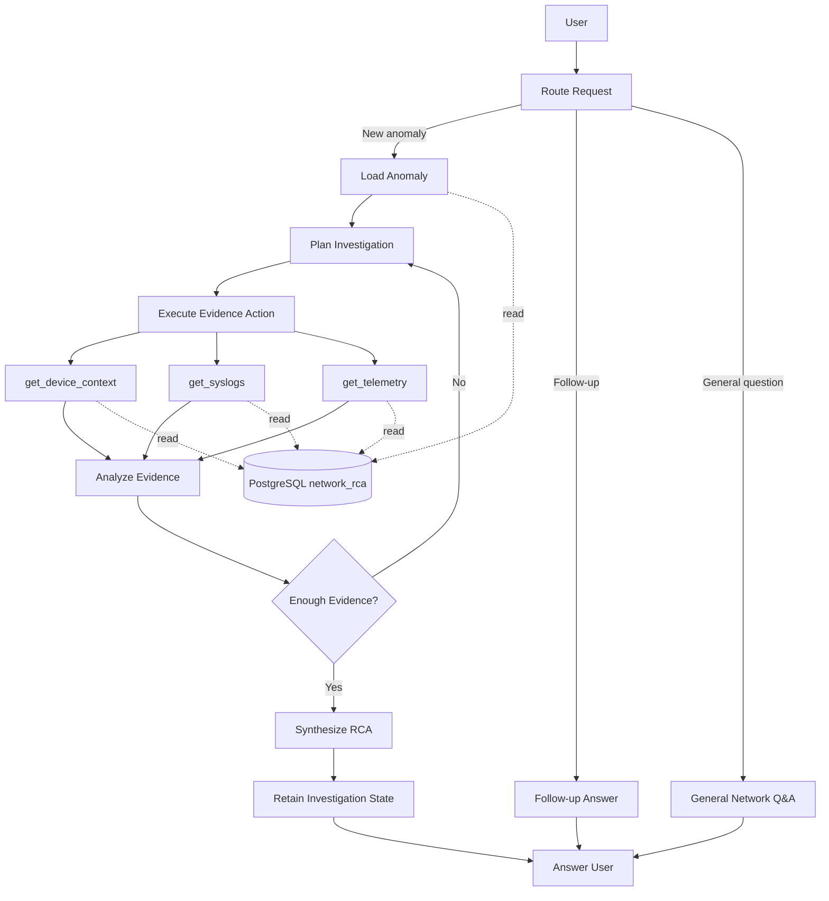

# Network Investigation Agent for Root Cause Analysis

This project implements a stateful Network Investigation Agent using **LangGraph**.

The goal of the agent is simple:

> Given a detected network anomaly, investigate the available network evidence and explain the most likely root cause, the evidence supporting it, the affected devices and timeframe, the confidence in the conclusion, and what uncertainty still remains.

The agent can also remember an investigation and answer follow-up questions without requiring the anomaly ID again.

---

# 1. Problem

The anomaly detection step has already happened.

The input to this system is an `anomaly_id` from the `detected_anomalies` table.

The job of the agent is to investigate that anomaly by looking at the available network data and answer questions such as:

- What probably caused the anomaly?
- Which devices were involved?
- What happened before and during the anomaly?
- What evidence supports the conclusion?
- How confident are we?
- What information is still missing?
- What should an engineer inspect next?

The important part of the challenge is that the investigation should not be a hardcoded lookup for each anomaly type.

The agent should decide what evidence it needs based on the current investigation.

---

# 2. What Was Provided

The challenge already provided the data and local infrastructure required for the investigation.

This included:

- PostgreSQL 16 database
- seeded network data
- 10 detected anomalies
- Docker / Compose environment
- JupyterLab
- Adminer
- database helper code
- starter LangGraph directory
- starter CLI
- schema documentation

The database is called:

```text
network_rca
```

I treated this infrastructure and dataset as the supplied environment and focused my implementation on the **agentic investigation layer**.

---

# 3. Database and Evidence Sources

There are four main tables available to the agent.

| Table | What it represents | Important columns |
|---|---|---|
| `detected_anomalies` | Output from anomaly detectors. This is the starting point of an investigation. | `anomaly_id`, `severity`, `model_output`, `anomaly_date` |
| `network_devices` | Device inventory and contextual information about network devices and sites. | `device_id`, `hostname`, `mgmt_ip`, `device_type`, `vendor`, `model`, `role`, `site_code`, `site_name`, `city`, `state`, `region`, `install_date`, `os_version`, `status`, `wan_provider`, `wan_circuit_id`, `wan_circuit_group`, `notes` |
| `device_syslogs` | Fine-grained timestamped device/network events. | `log_id`, `device_id`, `timestamp`, `severity`, `message_type`, `message` |
| `device_telemetry` | Hourly operational metrics for devices. | `device_id`, `timestamp`, `cpu_utilization_pct`, `memory_utilization_pct`, `temperature_celsius`, `active_sessions`, `bgp_established_peers`, `interfaces_up_ratio`, `interface_error_count`, `interface_flap_count`, `policy_deny_count`, `latency_ms`, `jitter_ms`, `packet_loss_pct` |

## Data Dictionary

### `detected_anomalies`

This is the entry point for a new RCA investigation.

| Column | Meaning |
|---|---|
| `anomaly_id` | Unique identifier for the detected anomaly |
| `severity` | Severity assigned to the anomaly |
| `model_output` | JSONB containing detector-specific information and investigation clues |
| `anomaly_date` | Date associated with the anomaly |

`model_output` may contain information such as:

- detector type
- anomaly window
- impacted hostnames
- impacted interfaces
- number of impacted hosts/interfaces
- signal scores
- criticality
- event summaries
- flap timelines

These fields are treated as **investigation clues**, not automatically as the final root cause.

The supplied data contains six detector types:

```text
interface_flap
interface_error
interface_availability
bgp_session
policy_deny
sdwan_path_quality
```

---

### `network_devices`

This table provides device and topology context.

| Column | Meaning |
|---|---|
| `device_id` | Internal device identifier |
| `hostname` | Network device hostname |
| `mgmt_ip` | Device management IP |
| `device_type` | Router, switch, firewall, SD-WAN edge, etc. |
| `vendor` | Device vendor |
| `model` | Hardware model |
| `role` | Functional role of the device |
| `site_code` | Site identifier |
| `site_name` | Human-readable site name |
| `city` | Device/site city |
| `state` | Device/site state |
| `region` | Network region |
| `install_date` | Device installation date |
| `os_version` | Running operating-system version |
| `status` | Current inventory status |
| `wan_provider` | WAN carrier/provider where applicable |
| `wan_circuit_id` | Associated WAN circuit |
| `wan_circuit_group` | Logical circuit group |
| `notes` | Additional contextual/topology information |

The `notes` field is particularly useful because some physical or logical connection information is represented there.

For example, it can help establish that interfaces on two different devices represent opposite ends of the same link.

---

### `device_syslogs`

Syslogs provide the most detailed event timeline available in the supplied dataset.

| Column | Meaning |
|---|---|
| `log_id` | Unique log identifier |
| `device_id` | Device associated with the event |
| `timestamp` | Event timestamp |
| `severity` | Syslog severity |
| `message_type` | Category/type of network event |
| `message` | Raw event description |

Syslogs are useful for evidence such as:

- physical interface down/up events
- optical warnings
- routing adjacency changes
- BGP events
- firewall/security events
- policy denies
- other device-generated operational messages

Because they contain fine-grained timestamps, they are useful for reconstructing event ordering.

---

### `device_telemetry`

Telemetry provides quantitative operational measurements over time.

| Column | Meaning |
|---|---|
| `device_id` | Device identifier |
| `timestamp` | Telemetry observation timestamp |
| `cpu_utilization_pct` | CPU utilization |
| `memory_utilization_pct` | Memory utilization |
| `temperature_celsius` | Device temperature |
| `active_sessions` | Number of active sessions |
| `bgp_established_peers` | Number of established BGP peers |
| `interfaces_up_ratio` | Proportion of interfaces currently up |
| `interface_error_count` | Interface error count |
| `interface_flap_count` | Interface flap count |
| `policy_deny_count` | Policy deny count |
| `latency_ms` | Network latency |
| `jitter_ms` | Network jitter |
| `packet_loss_pct` | Packet loss percentage |

Telemetry is useful for determining whether the event seen in logs is also visible in operational metrics and whether the device returns toward its normal state afterward.

All timestamps in the supplied dataset are treated as UTC.

---

# 4. How I Approached the Assignment

I did not start by immediately connecting an LLM to the database.

I built the solution in stages so that data-access problems, agent-reasoning problems, and conversation-memory problems could be tested separately.

## Step 1 — Understand the supplied data

I first inspected the schema and queried the four available tables.

This helped answer basic questions such as:

- What evidence is available?
- How many anomaly types exist?
- Which anomaly fields identify impacted devices?
- How granular are syslogs?
- How granular is telemetry?
- Where is topology information stored?

The supplied dataset contains:

- 10 anomalies
- 6 detector types
- 21 devices represented in telemetry
- hourly telemetry observations
- finer-grained syslog events

This step was important because the agent's tools should reflect the evidence actually available rather than an assumed network data model.

---

# 5. Reference Investigation Before Building the Agent

Before implementing the autonomous investigation flow, I manually investigated the required challenge anomaly:

```text
a1f0c8e2-1b44-4d90-9c31-000000000001
```

This was not production logic.

It was a reference investigation used to understand what a good RCA should look like and which tables contained useful evidence.

The anomaly identified two impacted devices:

```text
FAIRVIEW-EDG01
stonebridge-edg01
```

Device metadata showed that the impacted interfaces were opposite ends of the same backbone connection.

The syslog sequence showed:

1. optical degradation,
2. high pre-FEC BER / low receive power,
3. physical link DOWN,
4. physical link recovery,
5. OSPF neighbor disruption,
6. routing recovery,
7. another optical warning,
8. another link flap.

This established an important distinction for the RCA:

```text
Likely cause:
Optical / physical-layer degradation

Symptoms / downstream effects:
Physical link flaps -> OSPF disruption -> routing impact
```

It also showed what could **not** be concluded.

The available evidence does not establish whether the exact physical failure was:

- the transceiver,
- a connector,
- patch cabling,
- or the fiber itself.

That uncertainty should therefore remain in the final RCA.

This reference investigation gave me something concrete against which to validate the agent later.

---

# 6. Building the Tool Layer

The next step was implementing:

```text
agent/tools.py
```

I created four generic evidence tools:

```text
get_anomaly
get_device_context
get_syslogs
get_telemetry
```

### `get_anomaly`

Retrieves the anomaly and its detector metadata using an anomaly ID.

### `get_device_context`

Retrieves inventory and topology context for impacted hostnames.

### `get_syslogs`

Retrieves device events for selected devices and a selected time window.

### `get_telemetry`

Retrieves operational measurements for selected devices and a selected time window.

I deliberately organized the tools around **data/evidence sources rather than detector types**.

I did not create functions such as:

```text
investigate_interface_flap()
investigate_bgp()
investigate_sdwan()
```

That would have encoded the investigation workflow directly into application code.

Instead:

> The tools answer “What evidence can I access?” while the agent decides “Which evidence should I inspect next?”

This is the main scalability principle behind the tool design.

---

# 7. Defining Explicit Agent State

I next created:

```text
agent/state.py
```

An RCA investigation needs more than ordinary chat history.

The graph therefore maintains explicit state containing:

```text
messages
intent
anomaly_id
anomaly
device_context
syslogs
telemetry
investigation_summary
needs_more_evidence
investigation_round
rca
```

I separated the state conceptually into two parts.

### Conversation state

```text
messages
```

This allows conversational interaction.

### Investigation state

This contains the anomaly, evidence already collected, investigation progress, and final RCA.

This distinction matters because:

> Chat history and investigation state are not the same thing.

The agent should not have to reconstruct its entire technical investigation by repeatedly parsing previous natural-language messages.

---

# 8. Structured Schemas

I created:

```text
agent/schemas.py
```

Rather than allowing the LLM to return arbitrary text at every stage, structured Pydantic schemas are used for important decisions and outputs.

For example, an investigation action contains information such as:

```text
tool
reason
hostnames
device_ids
start_time
end_time
message_type
```

The final RCA is also structured into fields such as:

```text
root_cause
confidence
affected_devices
timeframe
supporting_evidence
contradictory_or_missing_evidence
downstream_impacts
recommended_next_checks
```

Each supporting evidence item records information such as:

```text
evidence_id
source
description
device
timestamp
```

This provides a lightweight **evidence ledger**.

Structured output makes the system:

- easier to validate,
- easier to test,
- easier to display in the UI,
- and easier to evaluate programmatically.

---

# 9. LangGraph Workflow

The main orchestration is implemented through:

```text
agent/graph.py
agent/nodes.py
```

I used LangGraph because the investigation is not a single prompt-response operation.

It is a stateful workflow containing decisions and loops.

The high-level architecture is:



The important investigation loop is:

```text
PLAN
  ↓
ACT
  ↓
OBSERVE
  ↓
ANALYZE
  ↓
ENOUGH EVIDENCE?
  ├── No  -> PLAN again
  └── Yes -> RCA
```

This gives the LLM controlled autonomy.

The LLM helps determine which evidence should be investigated, but LangGraph controls the possible execution paths.

---

# 10. Request Routing

The agent supports three types of requests.

## New investigation

Example:

```text
a1f0c8e2-1b44-4d90-9c31-000000000001
```

The agent loads the anomaly and starts an investigation.

## Follow-up

Example:

```text
Why do you believe this was a physical-layer problem?
```

or:

```text
What uncertainty remains?
```

The agent uses the retained investigation context rather than starting another investigation.

## General networking question

Example:

```text
What is the difference between a physical interface flap and an OSPF adjacency failure?
```

This does not require database evidence.

The agent therefore answers the question directly without unnecessarily querying PostgreSQL.

This routing avoids turning every user message into an expensive database investigation.

---

# 11. Investigation Planning

The planning logic lives in:

```text
agent/nodes.py
```

After the anomaly is loaded, the planner receives:

- anomaly metadata,
- evidence already collected,
- current investigation summary.

It then selects the next evidence action.

For example:

```text
get_device_context
```

may be selected when only hostnames are known.

After device IDs are available, the agent may decide that:

```text
get_syslogs
```

or:

```text
get_telemetry
```

is required.

The planner is instructed to prefer the **minimum evidence required to test the current hypothesis**.

It is also prevented from requesting invalid tool parameters.

Application code validates the tool arguments before execution.

This means the LLM participates in planning, while deterministic application code protects the execution boundary.

---

# 12. Evidence Sufficiency and Investigation Loop

After evidence has been retrieved, the agent determines whether enough evidence exists to make a grounded RCA.

If evidence is insufficient:

```text
Analyze Evidence
      ↓
Need more evidence
      ↓
Planner
      ↓
Another evidence tool
```

If evidence is sufficient:

```text
Analyze Evidence
      ↓
Evidence sufficient
      ↓
Generate RCA
```

The graph also maintains:

```text
investigation_round
```

This prevents an uncontrolled agent loop.

Therefore the implementation is not:

```python
while True:
    ask_llm()
```

Instead, autonomy operates inside explicit LangGraph boundaries.

---

# 13. Structured RCA

The final RCA separates several concepts that are easy to mix together in free-form text.

Example structure:

```text
Root cause
Confidence
Affected devices
Timeframe
Supporting evidence
Missing / contradictory evidence
Downstream impacts
Recommended next checks
```

This is particularly useful for network investigations because a symptom should not automatically become the root cause.

For example:

```text
Optical signal degradation
        ↓
Physical interface flap
        ↓
OSPF neighbor loss
        ↓
Routing disruption
```

The first item may represent the likely cause while the others represent consequences.

---

# 14. Conversational Memory

LangGraph checkpointing is used to preserve state for the same conversation thread.

That allows this interaction:

```text
User:
a1f0c8e2-1b44-4d90-9c31-000000000001

Agent:
<structured RCA>

User:
Why do you believe this was a physical-layer problem?

Agent:
<answers using previous investigation>

User:
What uncertainty remains?

Agent:
<answers using retained evidence>
```

The anomaly ID does not need to be supplied again.

This satisfies the conversational follow-up requirement while avoiding another full investigation.

---

# 15. CLI

The supplied `main.py` initially contained the CLI shell with a TODO for invoking the graph.

I completed this file so that the CLI now:

- builds the LangGraph application,
- creates a conversation thread,
- sends user messages into the graph,
- prints the structured RCA,
- supports follow-up questions,
- supports general questions.

Run:

```bash
python main.py
```

---

# 16. Lightweight Streamlit UI

I also added:

```text
streamlit_app.py
```

The Streamlit application is intentionally lightweight.

It is only a presentation layer around the same LangGraph application.

It does not contain a separate RCA implementation.

The goal is to make the investigation easier to demonstrate visually while keeping all reasoning and evidence logic in the agent layer.

Run:

```bash
streamlit run streamlit_app.py \
    --server.address 0.0.0.0 \
    --server.port 8501
```

---

# 17. Evaluation

I added an evaluation layer under:

```text
eval/
```

The evaluation runner executes the agent against all supplied anomalies and records information including:

- anomaly ID
- detector type
- severity
- success/failure
- investigation rounds
- confidence
- affected devices
- device context retrieved
- syslogs retrieved
- telemetry retrieved
- supporting evidence count
- missing evidence count
- root cause
- latency
- execution error

Detailed results are written to:

```text
eval/results/evaluation_results.csv
```

The final execution run covered all 10 supplied anomalies:

```text
Total anomalies:       10
Successful runs:       10
Failed runs:            0
Average investigation: 2.00 rounds
```

Detector coverage:

| Detector | Successful executions |
|---|---:|
| `bgp_session` | 1 / 1 |
| `interface_availability` | 1 / 1 |
| `interface_error` | 1 / 1 |
| `interface_flap` | 2 / 2 |
| `policy_deny` | 3 / 3 |
| `sdwan_path_quality` | 2 / 2 |

This demonstrates that the workflow executes across every detector type in the supplied dataset.

It should **not** be interpreted as 100% RCA semantic accuracy.

A true semantic accuracy benchmark would require independently reviewed gold-standard RCA labels for every anomaly.

---

# 18. Required Worked Example

For:

```text
a1f0c8e2-1b44-4d90-9c31-000000000001
```

the agent identified:

```text
Likely root cause:
Physical / optical-layer degradation on the backbone connection
between FAIRVIEW-EDG01 and stonebridge-edg01.
```

Supporting evidence included:

- low optical receive power,
- high pre-FEC BER,
- repeated optical warnings,
- synchronized physical link DOWN/UP events,
- routing disruption following the physical event.

The agent returned:

```text
Confidence: high
```

while still identifying missing evidence.

The exact failed physical component could not be determined from the supplied data.

It could be associated with:

- fiber,
- connector/patch cable,
- or transceiver optics.

The agent therefore recommends additional physical/optical diagnostics rather than inventing a more specific failure.

---

# 19. Files I Added or Modified

The implementation is deliberately separated by responsibility.

| File | Purpose | My work |
|---|---|---|
| `agent/tools.py` | Database evidence tools | Added generic anomaly, device, syslog and telemetry retrieval tools |
| `agent/state.py` | LangGraph state | Defined explicit conversation and investigation state |
| `agent/schemas.py` | Structured models | Added planning/action and structured RCA schemas |
| `agent/nodes.py` | Agent reasoning | Implemented routing, planning, evidence analysis, follow-up and RCA logic |
| `agent/graph.py` | LangGraph orchestration | Built nodes, edges, conditional routing, investigation loop and memory |
| `main.py` | CLI | Completed supplied CLI and connected it to the graph |
| `eval/run_eval.py` | Evaluation | Added repeatable evaluation across supplied anomalies |
| `eval/results/evaluation_results.csv` | Evaluation artifact | Stores detailed evaluation results |
| `streamlit_app.py` | Demo UI | Added lightweight frontend around the same agent |
| `docs/implementation_notes.md` | Engineering notes | Recorded design decisions and reference investigation |
| `README.md` | Documentation | Architecture, implementation and run instructions |
| `requirements.txt` | Dependencies | Added any additional runtime dependency required by the implementation |
| `podman-compose.yml` | Supplied environment | Only extended as needed to expose the Streamlit UI port |

---

# 20. Project Structure

```text
agentic-ai-rca-challenge/
│
├── README.md
├── Dockerfile
├── podman-compose.yml
│
├── docs/
│   ├── schema_reference.md
│   └── implementation_notes.md
│
└── starter_code/
    │
    ├── db.py
    ├── main.py
    ├── streamlit_app.py
    ├── requirements.txt
    │
    ├── agent/
    │   ├── __init__.py
    │   ├── state.py
    │   ├── schemas.py
    │   ├── tools.py
    │   ├── nodes.py
    │   └── graph.py
    │
    ├── eval/
    │   ├── run_eval.py
    │   └── results/
    │       └── evaluation_results.csv
    │
    └── notebooks/
        └── network_rca_agent.ipynb
```

---

# 21. Running the Project

Start the environment from the repository root:

```bash
docker compose -f podman-compose.yml up -d
```

The supplied Compose configuration mounts:

```text
./starter_code
```

from the local repository into:

```text
/home/jovyan/work
```

inside the Jupyter container.

Enter the container:

```bash
docker exec -it rca-jupyter bash
cd /home/jovyan/work
```

Run the CLI:

```bash
python main.py
```

Run evaluation:

```bash
python -m eval.run_eval
```

Run Streamlit:

```bash
streamlit run streamlit_app.py \
    --server.address 0.0.0.0 \
    --server.port 8501
```

---

# 22. Main Design Decisions

### 1. Generic evidence tools

Tools represent evidence sources rather than anomaly-specific workflows.

This allows the same investigation architecture to work across multiple detector types.

### 2. Explicit investigation state

I did not rely only on chat history.

The graph keeps structured evidence and investigation progress.

### 3. Controlled autonomy

The LLM decides what evidence would be useful, but LangGraph controls where execution can go.

### 4. Read-only investigation

The system investigates and recommends next checks.

It does not modify network configuration or perform autonomous remediation.

### 5. Evidence-grounded conclusions

The final RCA separates:

```text
cause
evidence
impact
confidence
uncertainty
```

If the available evidence cannot establish something, the agent should say so.

### 6. Minimum necessary evidence

The planner is encouraged to retrieve evidence that tests the current hypothesis rather than blindly querying every table for every anomaly.

### 7. One agent, multiple interfaces

The CLI and Streamlit application use the same LangGraph implementation.

The UI does not contain a second investigation workflow.

---

# 23. Limitations

The system is intentionally scoped to the supplied challenge environment.

Current limitations include:

- RCA quality depends on the evidence available in the seeded dataset.
- Physical root causes cannot always be isolated to an exact component.
- Detailed network topology is limited.
- Telemetry is less granular than syslog events.
- LLM provider rate limits can affect batch evaluation throughput.
- The evaluation dataset is small.
- Execution success across the supplied anomalies does not by itself establish semantic RCA accuracy.

A production version could add:

- a larger SME-reviewed RCA benchmark,
- richer topology data,
- incident/change-management evidence,
- additional telemetry sources,
- persistent investigation storage,
- agent tracing and observability,
- semantic RCA evaluation.

---

# 24. Summary

I approached this assignment as an **investigation problem rather than an anomaly-detection problem**.

The anomaly detector tells us:

> Something unusual happened.

The Network Investigation Agent tries to answer:

> What most likely happened, what evidence supports that conclusion, what was affected, and what do we still not know?

The implementation combines:

```text
LangGraph
    +
structured investigation state
    +
generic PostgreSQL evidence tools
    +
LLM-based planning
    +
controlled evidence loops
    +
structured RCA
    +
conversation memory
```

to make that investigation evidence-driven, explainable, and conversational.
